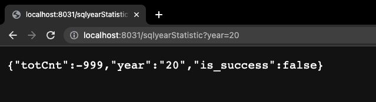
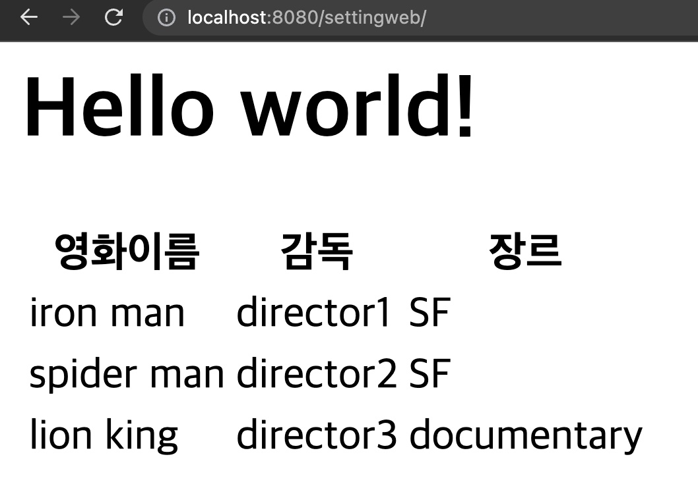

# comento_bootcamp

실제 spring boot 를 통한 구현은 아래 링크에서 이루어지고 있습니다.
https://github.com/rohsik2/commento_bootcamp_springboot

## Week4 - Spring boot로 api 구현하기
첫 2자리만 비교해서 연도를 비교해내는 예제코드를 보고 굳이 date로 변환이후 year함수를 통해 가져왔던 순간들이 안타까워 졌습니다.

이후 api docs를 수정해서 연월일을 yyyymmdd에서 yymmdd로 바꾸었고 데이터 베이스와 바로 비교가 가능하도록 만들었습니다.

각각의 쿼리가 굉장히 유사항 형태를 띄기에 원래 요구하는 타입 , 연월일, 등등을 가지고 함수를 9개 작성하려 했으나 그럴필요가 없게 sql을 새롭게 설계하였습니다.
 


## Week3 - Spring boot 설정 + SQL 작성하기
spring boot 설정은 몇번 경험이 있어 빠르게 마칠수 있었습니다.

### 질문사항들
1. DB는 대소문자 구분이 없는걸로 아는데 camelCase를 snake_case 대신사용한 이유? 

ex) requestInfo.userId vs request_info.user_id

2. 바로 date형태로 저장하면 안되나? 

ex) 2018-02-01-12-35 와 같은 형식이나 , timestamp 대신에 1802011235와 같이 쓰는이유?

3. pk를 사용하지 않고 varchar를 통해서 연결해둔이유?


```SQL
-- 1. 월별 접속자 수
SELECT COUNT(userID)
FROM requestInfo
WHERE createDate BETWEEN '2008010000' AND '2008312359'; -- 그냥 단순 비트윈에는 date 변환을 진행하지 않았음.


-- 2) 일자별 접속자 수
SELECT COUNT(userID)
FROM requestInfo
WHERE createDate BETWEEN '2008010000' AND '2008012359'; -- 그냥 단순 비트윈에는 date 변환을 진행하지 않았음.

-- 3) 평균 하루 로그인 수 (월간)
SELECT AVG(a.counter) FROM -- 카운터의 평균을 내서 구함.
(
	-- ymd라는 변수에 date형태의 연월일을 뽑음, 개수를 세어서 리턴
	SELECT DATE(str_to_date(createDate,'%y%m%d%H%i')) ymd, COUNT(*) as counter 
	FROM statistc.requestInfo
	-- 연도를 비교하기 위해 date변환 이후 year함수 사용 
	WHERE YEAR(str_to_date(createDate,'%y%m%d%H%i')) = YEAR(str_to_date('2008010000','%y%m%d%H%i')) 
		 --월을 비교하기 위해 ~
		and MONTH(str_to_date(createDate,'%y%m%d%H%i')) = MONTH(str_to_date('2008010000','%y%m%d%H%i'))
	GROUP BY ymd) a;

-- 4) 휴일을 제외한 로그인 수(일간) ( 해당 문제에서는 휴일을 포함합니다.)
SELECT AVG(a.counter) FROM
(
	SELECT DATE(str_to_date(createDate,'%y%m%d%H%i')) ymd, COUNT(*) as counter -- 일간데이터는 DATE끼리 비교로 가능.
	FROM requestInfo 
	WHERE DATE(str_to_date(createDate,'%y%m%d%H%i')) = DATE(str_to_date('2008010000','%y%m%d%H%i'))
	GROUP BY ymd) a;

-- 5) 부서별 월별 로그인 수
SELECT user.HR_ORGAN, COUNT(*) -- 부서이름과 부서별 갯수를 리턴 
FROM requestInfo Inner Join user -- 이너조인으로 연결 
ON requestInfo.userID = user.userID -- 리퀘인포테이블의 유저와 유저테이블의 유저를  조인한다. 
WHERE YEAR(str_to_date(requestInfo.createDate,'%y%m%d%H%i')) = YEAR(str_to_date('2008010000','%y%m%d%H%i')) 
		and MONTH(str_to_date(requestInfo.createDate,'%y%m%d%H%i')) = MONTH(str_to_date('2008010000','%y%m%d%H%i'))
GROUP BY user.HR_ORGAN -- 그룹은 부서명으로 
```

설정완료화면




## Week2 - api Docs 작성하기

작성한 api docs는 아래 링크에서 확인하실 수 있습니다.

https://boiling-brick-4a4.notion.site/SW-API-919f87d945f9409cae39aa6e8a6a69fd

### What I Learend

Path Variable? - url 경로를 이용해서 데이터를 서버로 넘기는것.

```
@RequestMapping(value = "/user/email/{email}", method=RequestMethod.GET)
def someController(@PathVariable String email)

```

위와 같은 코드에서 {email} 에 들어가는 String을 mapping을 통해서 spring controller로 받아 올 수 있음.

API?

https://boiling-brick-4a4.notion.site/RESTful-API-d6890c6b804f4f1d9380f2a69cf91b86


## Week1 - 개발환경 마련하기

### 개발환경
Eclipse(2021.12 + JDK 1.8)로 구성했습니다.

주요 라이브러리 정보

Spring : 5.1.8

Maven-eclipse-plugin : 2.9

Maven-compile-plugin : 2.5.1


### 겪었던 문제점

Eclipse 설치 문제 - JAVA EE 를 사용해서 해결

Oracle JDK가 개발자 서명 문제로 m1 mac에서 동작안함.

intelliJ 이용해서 JDK를 다운로드 받고, 해당 JDK를 사용해서 성공.


### 성공화면


