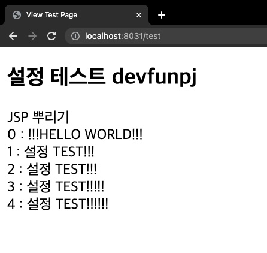

# comento_bootcamp

## Week3 - Spring boot 설정 + SQL 작성하기
spring boot 설정은 몇번 경험이 있어 빠르게 마칠수 있었습니다.



```SQL
-- 1. 월별 접속자 수
SELECT COUNT(userID)
FROM requestInfo
WHERE createDate BETWEEN '2008010000' AND '2008312359';

-- 2) 일자별 접속자 수
SELECT COUNT(userID)
FROM requestInfo
WHERE createDate BETWEEN '2008010000' AND '2008012359';

-- 3) 평균 하루 로그인 수 (월간)
SELECT AVG(a.counter) FROM
(
	SELECT DATE(str_to_date(createDate,'%y%m%d%H%i')) ymd, COUNT(*) as counter 
	FROM statistc.requestInfo
	WHERE YEAR(str_to_date(createDate,'%y%m%d%H%i')) = YEAR(str_to_date('2008010000','%y%m%d%H%i'))
		and MONTH(str_to_date(createDate,'%y%m%d%H%i')) = MONTH(str_to_date('2008010000','%y%m%d%H%i'))
	GROUP BY ymd) a;

-- 4) 휴일을 제외한 로그인 수(일간) ( 해당 문제에서는 휴일을 포함합니다.)
SELECT AVG(a.counter) FROM
(
	SELECT DATE(str_to_date(createDate,'%y%m%d%H%i')) ymd, COUNT(*) as counter 
	FROM requestInfo 
	WHERE DATE(str_to_date(createDate,'%y%m%d%H%i')) = DATE(str_to_date('2008010000','%y%m%d%H%i'))
	GROUP BY ymd) a;

-- 5) 부서별 월별 로그인 수

SELECT user.HR_ORGAN, COUNT(*)
FROM requestInfo Inner Join user
ON requestInfo.userID = user.userID
WHERE user.HR_ORGAN LIKE "Front" 
		and YEAR(str_to_date(requestInfo.createDate,'%y%m%d%H%i')) = YEAR(str_to_date('2008010000','%y%m%d%H%i'))
		and MONTH(str_to_date(requestInfo.createDate,'%y%m%d%H%i')) = MONTH(str_to_date('2008010000','%y%m%d%H%i'))
GROUP BY user.HR_ORGAN
```


## Week2 - api Docs 작성하기

작성한 api docs는 아래 링크에서 확인하실 수 있습니다.

https://boiling-brick-4a4.notion.site/SW-API-919f87d945f9409cae39aa6e8a6a69fd

### What I Learend

Path Variable? - url 경로를 이용해서 데이터를 서버로 넘기는것.

```
@RequestMapping(value = "/user/email/{email}", method=RequestMethod.GET)
def someController(@PathVariable String email)

```

위와 같은 코드에서 {email} 에 들어가는 String을 mapping을 통해서 spring controller로 받아 올 수 있음.

API?

https://boiling-brick-4a4.notion.site/RESTful-API-d6890c6b804f4f1d9380f2a69cf91b86


## Week1 - 개발환경 마련하기

### 개발환경
Eclipse(2021.12 + JDK 1.8)로 구성했습니다.

주요 라이브러리 정보

Spring : 5.1.8

Maven-eclipse-plugin : 2.9

Maven-compile-plugin : 2.5.1


### 겪었던 문제점

Eclipse 설치 문제 - JAVA EE 를 사용해서 해결

Oracle JDK가 개발자 서명 문제로 m1 mac에서 동작안함.

intelliJ 이용해서 JDK를 다운로드 받고, 해당 JDK를 사용해서 성공.


### 성공화면


